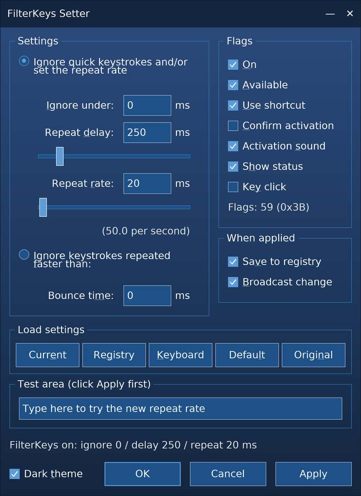
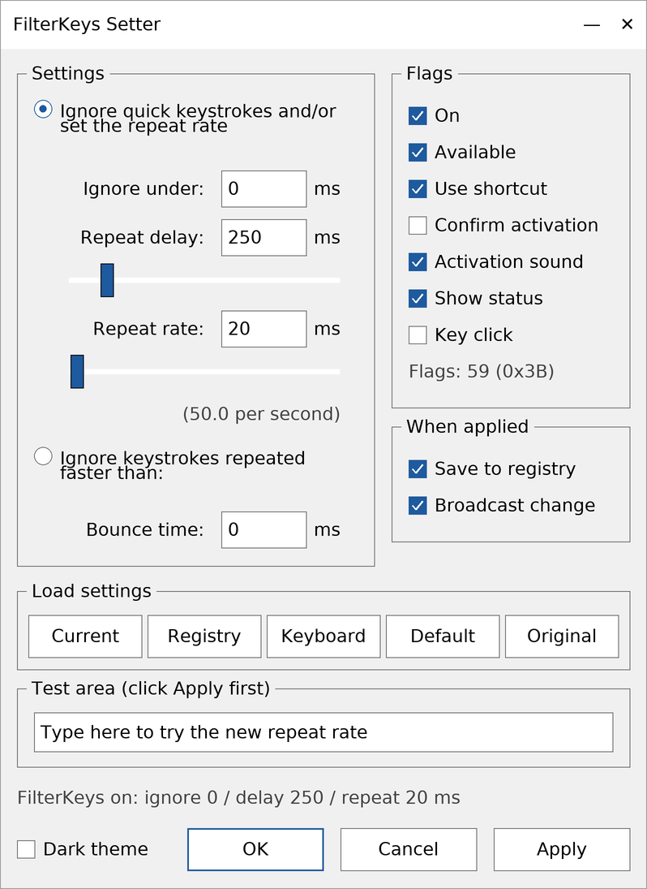

<p align="center">
  
</p>

<h1 align="center">Filterkeys setter</h1>

<p align="center">
  <a href="https://github.com/EhabYT/Filterkeys-setter/actions/workflows/build.yml"></a>
</p>

Original version 1.02 from Soarer's article [FilterKeys Setter... for a faster key repeat (in Windows)](https://geekhack.org/index.php?topic=41881.0).

# Version history
* 1.11 2026-10-07 Dark theme with repeat sliders, tool tips on every setting,
  Alt accelerators on every control, Segoe UI dialog font, system DPI
  awareness, new application icon and logo; several failure paths fixed that
  silently zeroed the settings when a system read failed; MFC Feature Pack
  headers dropped, installer upgraded to a proper major upgrade, builds with
  both Visual Studio 2022 and Visual Studio 2026
* 1.10 2024-01-28 No changes - Visual Studio 2022 build
* 1.02 2013-10-30 Soarer's release

# Appearance

The dialog ships with a dark theme built from the palette of the application
icon: a navy background that deepens from `#2A4A7B` through `#1F3A61` to
`#14263F`, `#1D5188` input surfaces and a `#5D9CD6` accent. Clear the
*Dark theme* check box next to the *OK* button to fall back to the native
light look; the choice is remembered in
`HKEY_CURRENT_USER\Software\FilterKeysSetter\Theme`.

Every control can be reached from the keyboard: hold `Alt` to see the
underlined accelerators (`Alt`+`D` for the repeat delay, `Alt`+`K` for the
*Keyboard* preset, `Alt`+`P` for *Apply*, and so on), `Tab` walks the groups,
`Enter` confirms, `Esc` cancels. The full table is in
[docs/UI-UPGRADE.md](docs/UI-UPGRADE.md#keyboard-accelerators).

The repeat delay and repeat rate can be dialled in with sliders as well as
typed as exact millisecond values -- the two stay in sync, and the edit box
remains authoritative for values outside the slider range.

# Building

The project is an MFC desktop application. It builds with **Visual Studio 2022
and Visual Studio 2026** -- the platform toolset is not hard-coded, it resolves
to whichever toolset the running Visual Studio provides (`v143` in 2022, `v145`
in 2026, which no longer ships `v143`).

* **Visual Studio:** open `FilterKeysSetter.sln` and build the `Release` configuration for `x86` or `x64`.
  Requires the *Desktop development with C++* workload **plus the matching MFC component**, which is
  not part of that workload by default and is the usual cause of a failing build at `afxwin.h`:
  * VS 2026: *C++ MFC for latest v145 build tools (x86 & x64)*
  * VS 2022: *C++ MFC for latest v143 build tools (x86 & x64)*

  Decline the *Retarget solution* prompt in VS 2026, or answer it with *Install missing platform
  toolset*: retargeting writes a fixed `<PlatformToolset>v145</PlatformToolset>` into the project
  and would break the build for anyone still on VS 2022.
* **Command line:**

  ```cmd
  msbuild FilterKeysSetter.sln /p:Configuration=Release /p:Platform=x64
  ```

  Add `/p:PlatformToolset=v143` to pin an older toolset when several are installed side by side.
  Note the platform names: the **solution** calls the 32-bit platform `x86`, the **project** calls
  it `Win32`. `msbuild FilterKeysSetter.sln /p:Platform=Win32` fails with `MSB4126`; either use
  `x86` there, or build `FilterKeysSetter.vcxproj`, which is what `tools\build.cmd` does.
* **One-shot script:** `tools\build.cmd` finds the installed Visual Studio through `vswhere`,
  warns when the MFC component is missing, rebuilds `Release` for `Win32` and `x64`, and prints
  every error and warning at the end. Logs land in `build-Release-<platform>.log`.

  ```cmd
  tools\build.cmd                 :: both platforms, Release
  tools\build.cmd x64 Debug       :: one platform and configuration
  tools\build.cmd x64 Release v143 :: pin a toolset when several are installed
  ```

  It accepts `x86` as a synonym for `Win32` and rejects anything else with a
  sentence instead of an MSBuild error code.

To produce the release binaries in one go, `tools\release.cmd` builds both
platforms, collects them under `release\` with their SHA-256 hashes, and can
upload them to a GitHub release. The full procedure, including which four
files carry the version number, is in [docs/RELEASE.md](docs/RELEASE.md).

The `FilterKeysSetter.Setup` project needs the free
[Microsoft Visual Studio Installer Projects](https://marketplace.visualstudio.com/items?itemName=VisualStudioClient.MicrosoftVisualStudio2022InstallerProjects)
extension, version 3.0.0 or newer for VS 2026. Without it the solution still opens and the
application still builds; only the `.vdproj` fails to load.

A build workflow for both `Win32` and `x64` is prepared in
`.github/workflows/build.yml`, but it is **not active yet**: it exists only in
the working tree of the branch, because the account that produced these
changes cannot push workflow files. Until someone commits it, the badge above
stays grey and nothing here has been compiled in CI.

## Checks that do run anywhere

Five Python scripts stand in for the compiler while no toolchain is
available. They need nothing but a Python 3 install and take under a second
together:

```cmd
python tools\check-dialog-layout.py    :: geometry, captions, accelerators, tab stops
python tools\check-message-map.py      :: MFC message maps, DDX and tool tip wiring
python tools\check-resources.py        :: resource IDs, the icon container, versions
python tools\check-error-handling.py   :: Win32 results that are thrown away
python tools\check-project.py          :: project references, configurations, precompiled header
python tools\selftest.py               :: breaks the sources on purpose to test the five above
```

# Usage

| Dark theme (default) | Light theme |
| --- | --- |
|  |  |

Set *Repeat delay* and *Repeat rate* with the sliders or type exact millisecond
values, type into the test area to feel the result, then press *Apply*. Tick
*Save to registry* to keep the settings across restarts. The *Load settings*
row fills the dialog from the current system state, the registry, the standard
keyboard control panel values, the Windows defaults, or the values that were
active when the program started.

> **About these two pictures:** they are *rendered* from `FilterKeysSetter.rc`
> and the palette in `Theme.cpp` by `tools/render-dialog.py` -- they are not
> screenshots of a running program. Every control sits exactly where the
> resource script puts it, but the dialog font is substituted and the native
> control chrome is only approximated. They will be replaced with real
> screenshots once a build is available. The screenshot of the original
> version 1.02 lives in
> [Soarer's geekhack thread](https://geekhack.org/index.php?topic=41881.0).
