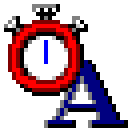

<p align="center">
  
</p>

<h1 align="center">Filterkeys setter</h1>

<p align="center">
  <a href="https://github.com/EhabYT/Filterkeys-setter/actions/workflows/build.yml"></a>
</p>

Original version 1.02 from Soarer's article [FilterKeys Setter... for a faster key repeat (in Windows)](https://geekhack.org/index.php?topic=41881.0).

# Version history
* 1.11 2026-10-06 New application icon and logo; CI build workflow for Win32 and x64
* 1.10 2024-01-28 No changes - Visual Studio 2022 build
* 1.02 2013-10-30 Soarer's release

# Building

The project is an MFC desktop application built with the Visual Studio 2022 toolset (`v143`).

* **Visual Studio:** open `FilterKeysSetter.sln` and build the `Release` configuration for `x86` or `x64`.
  Requires the *Desktop development with C++* workload including *MFC for latest v143 build tools*.
* **Command line:**

  ```cmd
  msbuild FilterKeysSetter.sln /p:Configuration=Release /p:Platform=x64
  ```

Every push and pull request is built for both `Win32` and `x64` by the
[build workflow](.github/workflows/build.yml), which publishes the resulting
`FilterKeysSetter.exe` as a downloadable artifact.

# Usage:

